## 实验一    相关软件的安装

### 一、Android Studio 2021.1版本的安装

### ①前往官网下载

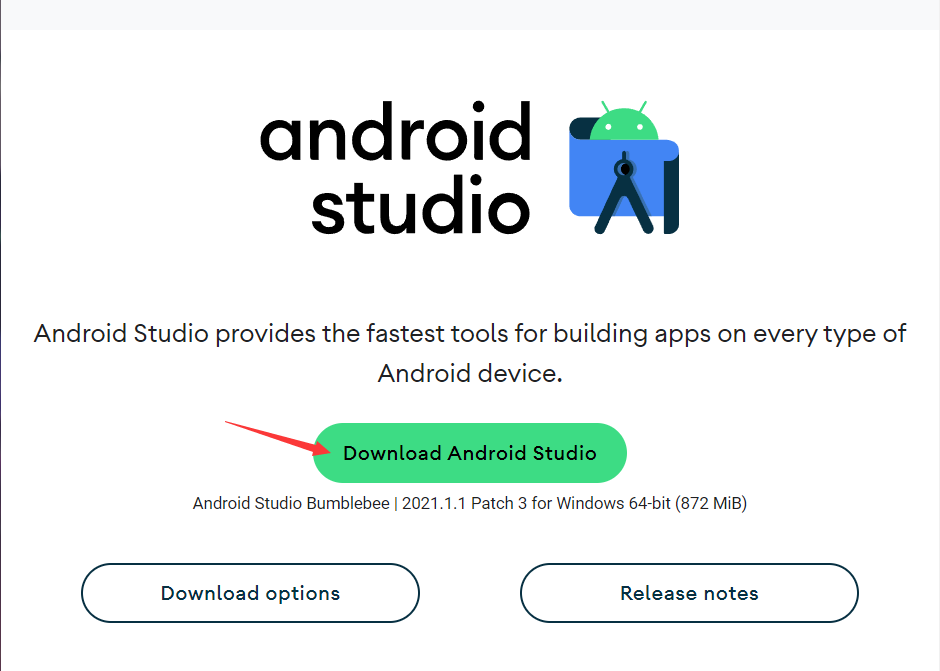

### ②创建录

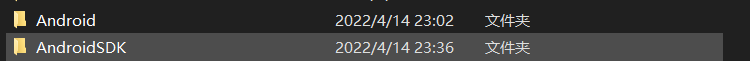

### ③运行安装文件

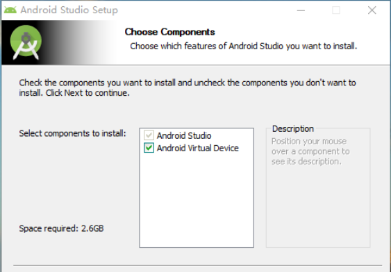

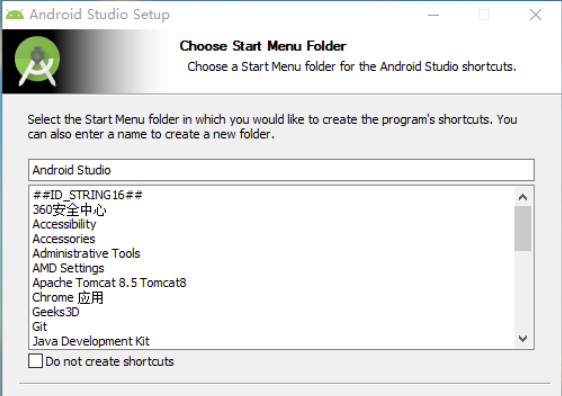

点击安装：

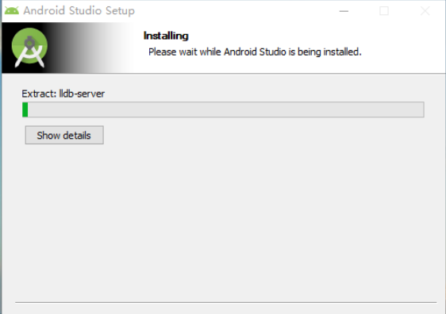

安装完毕，点击finish启动：

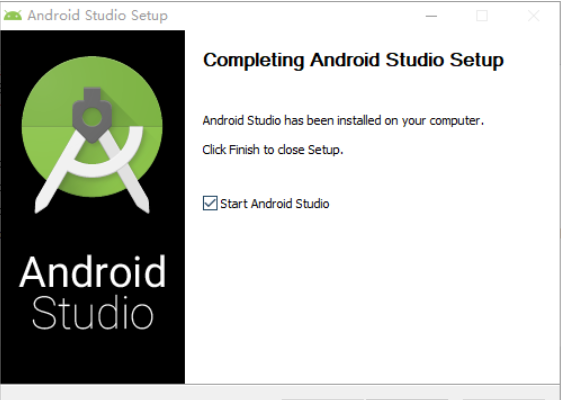

选择Do not import settings:

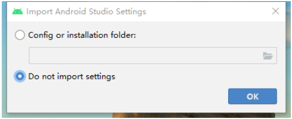

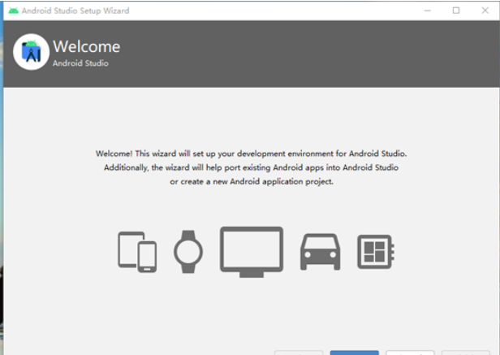

点击next：

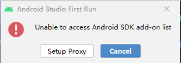

自定义选择目录，设置虚拟机相关配置：

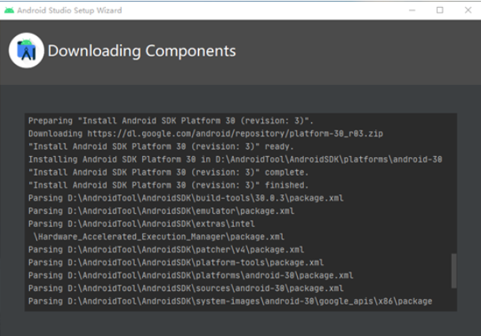

创建新项目：

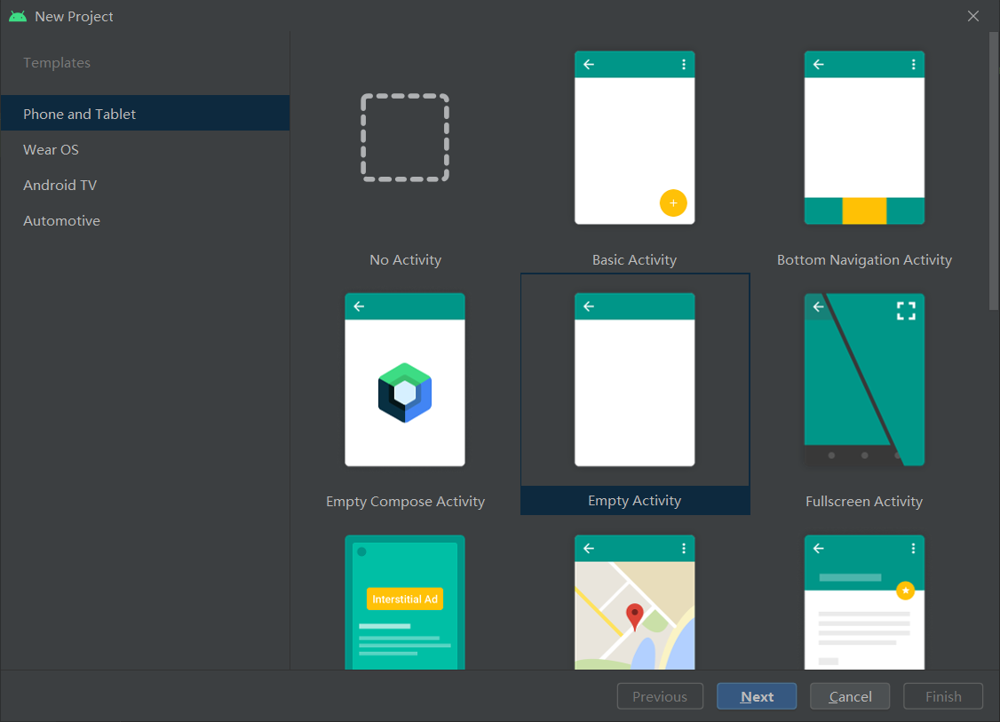

运行：

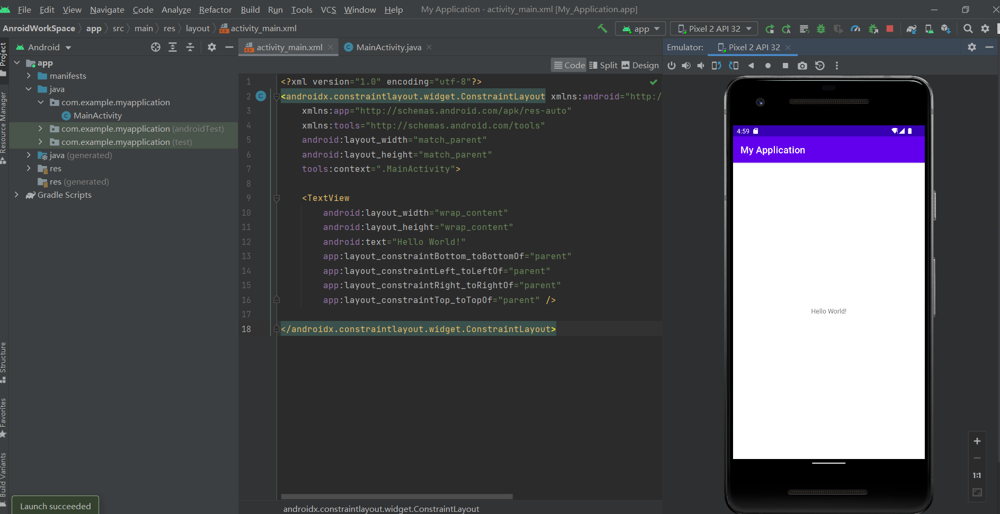

至此，安装完成。

### 二、Anaconda的安装

### ①下载安装程序

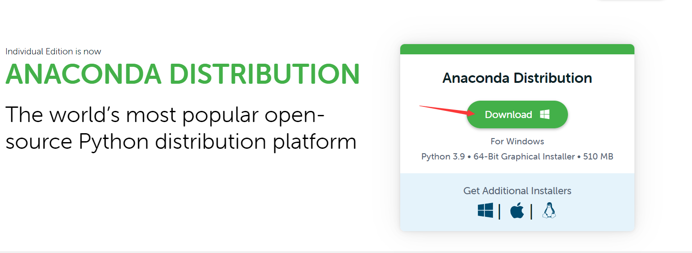

### ②安装，选择安装路径：

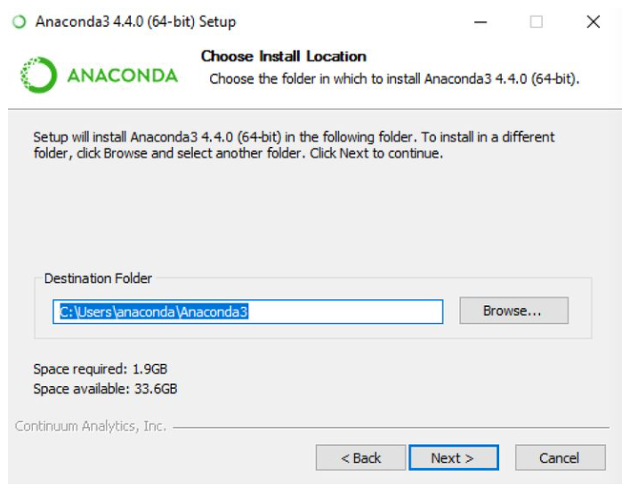

选择第二项，不勾选第一项：

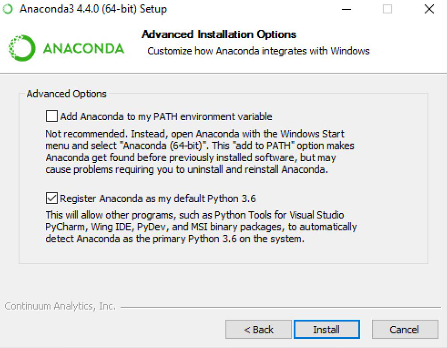

next：

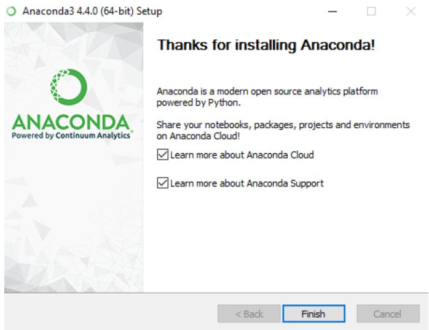

验证安装结果：

①开始-》Anaconda-》Anaconda Navigator-》启动成功

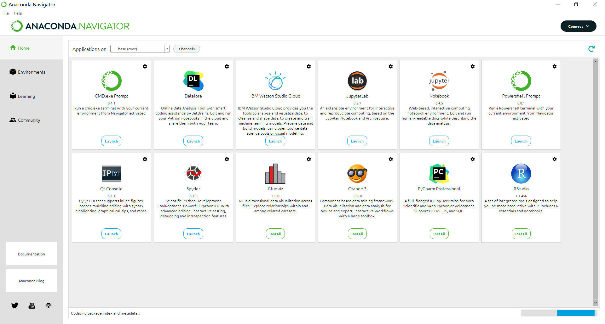

②开始-》Anaconda-》右键点击Anaconda Prompt-》以管理员身份运行，输入conda list，显示了包名和版本号：

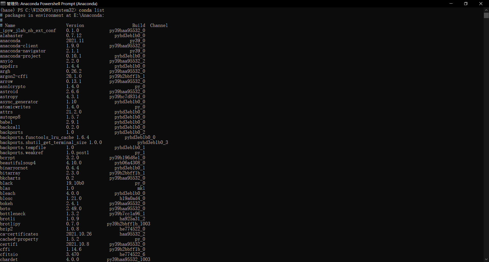

安装成功

