## 实验二、创建首个Kotlin应用

### ①创建一个新的工程

打开Andriod studio，选择projects->New Project,然后选择Basic Activity

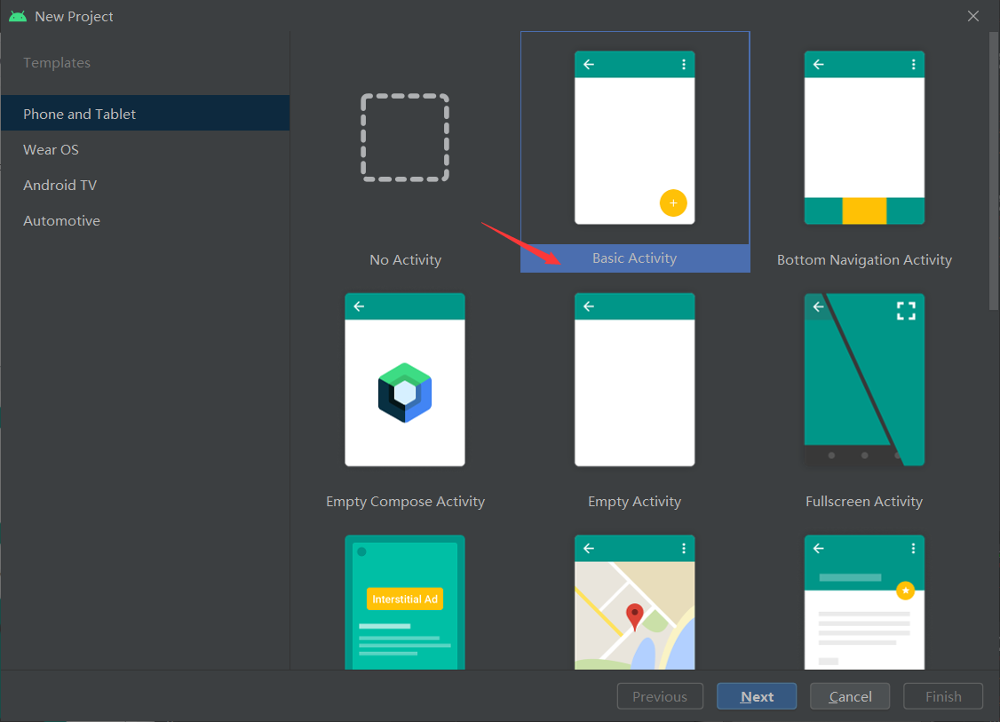

点击Next，为应用程序命名（这里为My1stApp）,选择Kotlin语言，然后点击Finish（这里是已经创建后的演示，所以会提示已存在）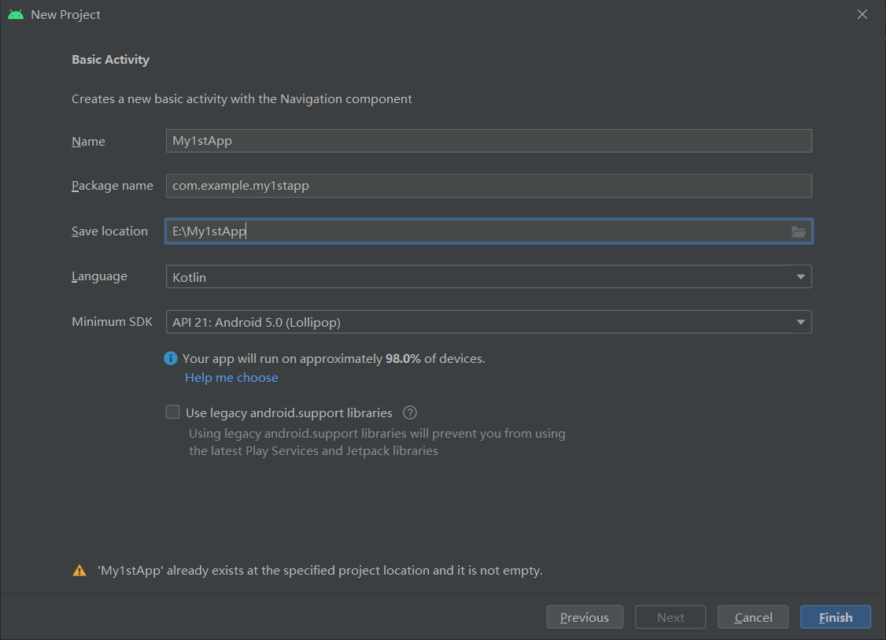

### ②Andriod Studio 的界面布局

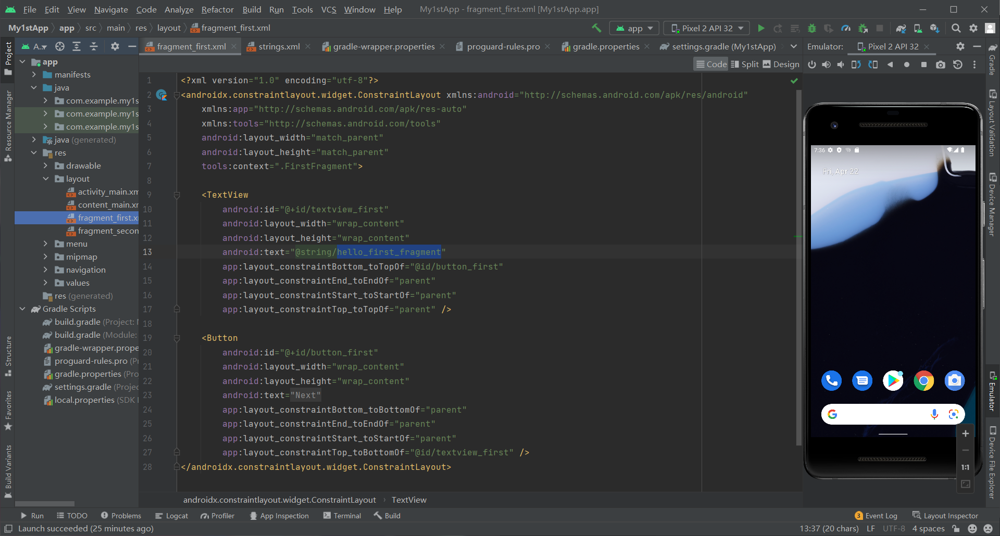

### ③创建模拟器

创建可以运行APP的模拟器，点击Tool->Device Manager，然后点击Create device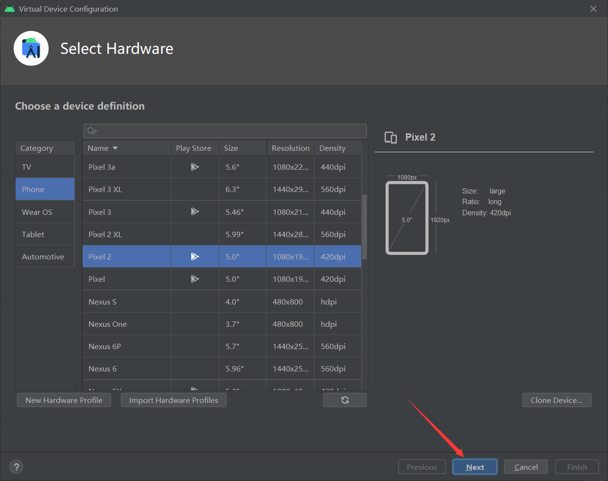

点击Next 选择镜像后等待下载安装，创建完毕。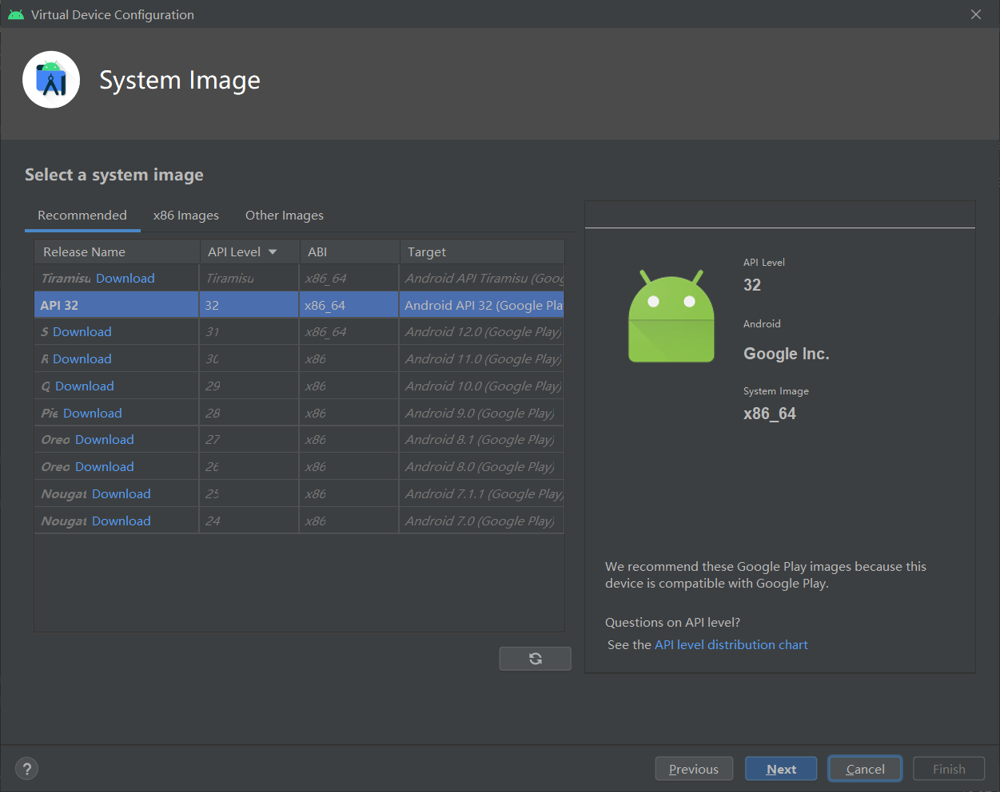

### ④在模拟器上运行应用程序

先开启模拟器，然后选择Run->Run'app'

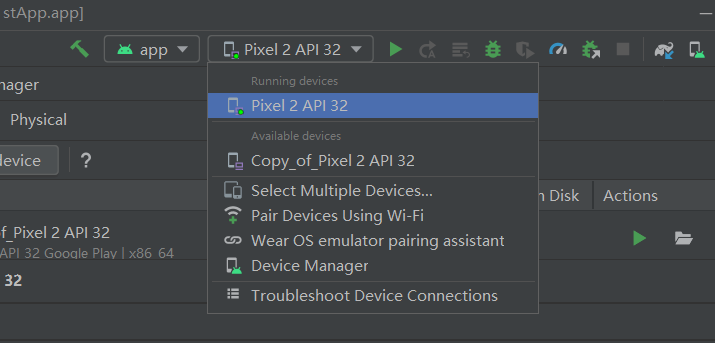

运行效果：

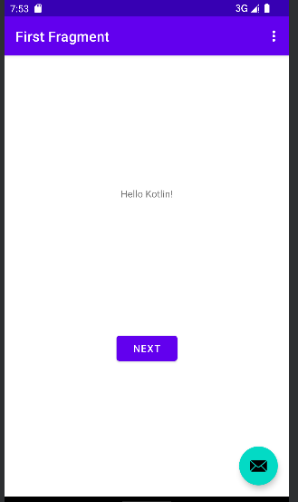

### ⑤查看布局编辑器

在Basic Activity中，包含了基本的导航组件，Android app关联了两个fragments，第一个屏幕显示“Hello first fragment”由FirstFragment创建，界面元素的排列由布局文件指定，点击res>layout>fragment_first.xml，查看布局文件：

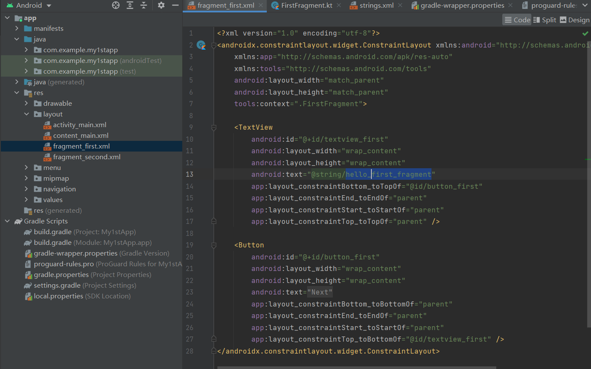

点击布局的代码Code，修改TextView的Text属性：

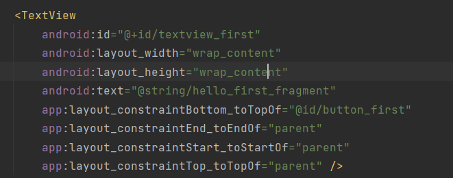

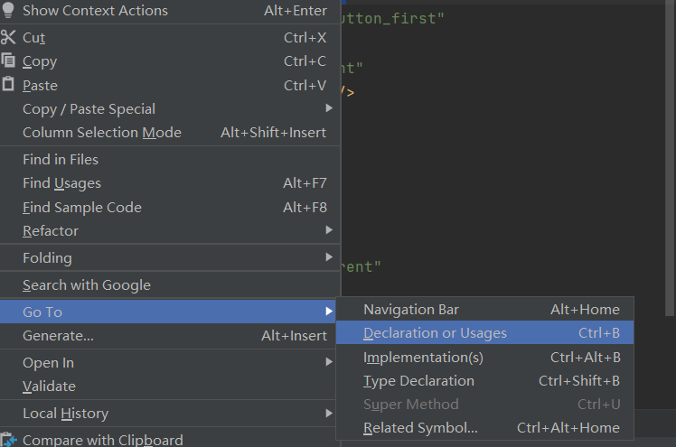

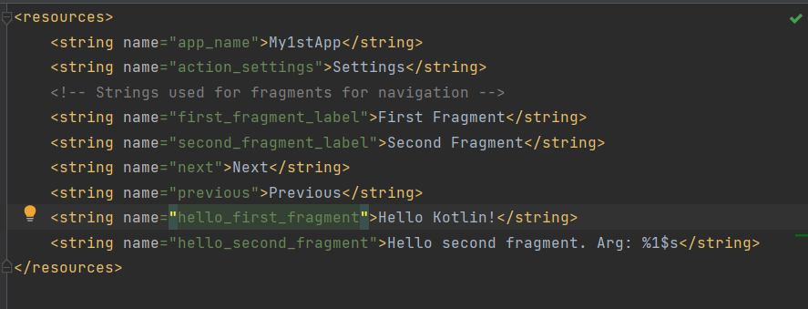

可以看到，属性已被修改为Hello Kotlin!,现在，修改字体显示属性，选择Design视图中**textview_first**文件，在Common Attributes属性下textAppearance区域，设置相关文字显示属性。

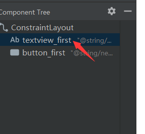

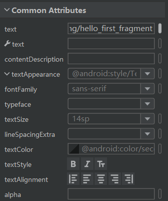

修改完毕后，查看布局中的XML代码，即可看到新属性已经被应用，可通过重新运行应用程序，查看显示效果。

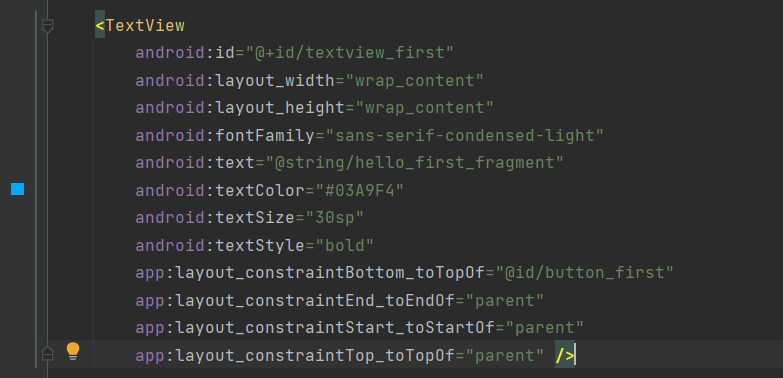

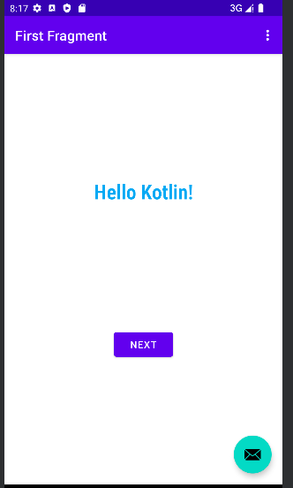

### ⑥在页面上添加更多布局

例如，向第一个Fragment添加更多的视图组件

**首先，查看视图的布局约束**

在fragment_first.xml,查看TextView组件的约束属性：

```xml
app:layout_constraintBottom_toTopOf="@id/button_first"
app:layout_constraintEnd_toEndOf="parent"
app:layout_constraintStart_toStartOf="parent"
app:layout_constraintTop_toTopOf="parent"
```

在约束布局中，每个组件都至少需要一个水平及垂直方向的约束。

### ⑦添加按钮和约束

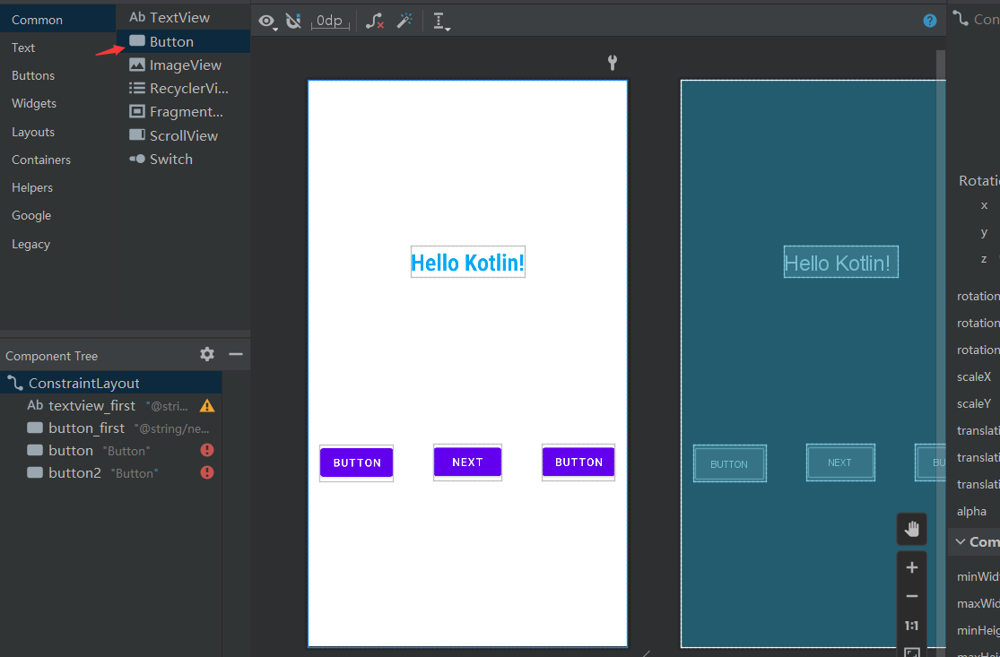

调整button的约束，设置Button的Top-》BottonOfTextView

```xml
app:layout_constraintTop_toBottomOf="@+id/textview_first"
```

然后添加Button的左侧约束至屏幕左侧，Button的底部约束至屏幕底部，查看右侧Attributes面板，修改将id从button修改为toast_button

### ⑧调整Next按钮

Next按钮是工程创建时的默认按钮，查看其布局设计视图，可以看出，其与TextView之间的连接不是锯齿状，而是波浪状，表面这两者之间存在链（chain），这是两个组件间的双向联系，而非单项联系。删除两者之间的链后，可在设计视图右键相应约束，选择Delete（注意，两个组件要双向删除）

### ⑨添加新的约束

添加Next的右边和底部约束至父类屏幕，Next的Top约束至TextView的底部。最后TextView的底部约束至屏幕底部：

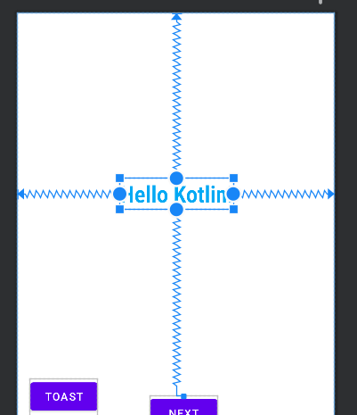

### ⑩更改组件的文本

在fragment_first.xml布局文件中的toast_button按钮的text属性部分如下：

```xml
<Button
    android:id="@+id/toast_button"
    android:layout_width="wrap_content"
    android:layout_height="wrap_content"
    android:layout_marginStart="16dp"
    android:text="TOAST"
    app:layout_constraintBottom_toBottomOf="parent"
    app:layout_constraintStart_toStartOf="parent"
    app:layout_constraintTop_toBottomOf="@+id/textview_first"
    app:layout_constraintVertical_bias="0.515" />
```

在此处，text的赋值是一种硬编码，点击文本，左侧出现灯泡状提示，选择Extract string resource：

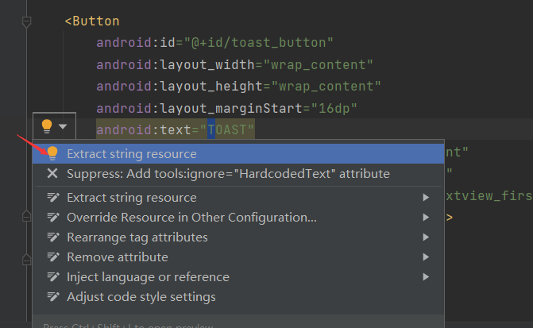

弹出对话框，令资源名为toast_button_text，资源值为Toast,选择OK：

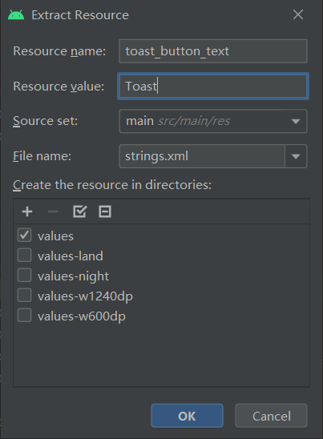

即：在资资源文件string.xml中定义了该字符串，以上操作也可手动在该文件中定义并引用：

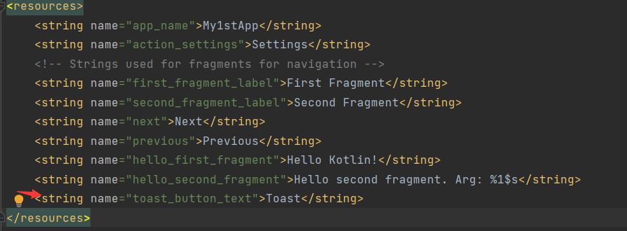

### 11、更新Next按钮

在属性面板中更改Next按钮的id，从botton_first改为random_button:

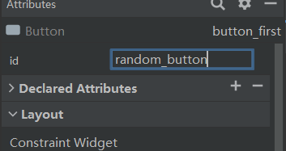

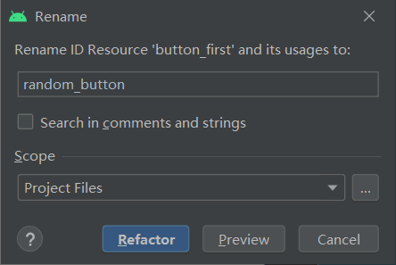

在string.xml文件，右键next字符串资源，选择Refacotr->Rename，修改资源名称为random_button_text.之后，修改Next值为Random。

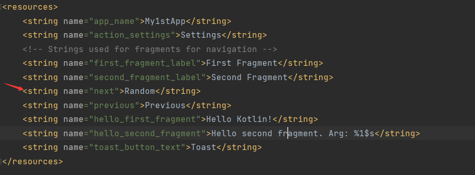

### 12、添加第三个按钮

向fragment_first.xml文件中添加第三个按钮，位于Toast和Random按钮之间，TextView的下方。新Button的左右约束分别约束至Toast和Random,Top约束至TextView的底部，Buttom约束至屏幕的底部：

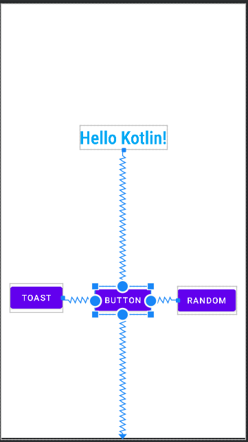

### 13、完善UI组件的属性设置

更改新增按钮id为count_button,显示字符串为Count,对应字符串资源值为count_button_text，同时更改TextView的文本为0。以下为修改后的fragment_first.xml的代码：

```xml
<?xml version="1.0" encoding="utf-8"?>
<androidx.constraintlayout.widget.ConstraintLayout xmlns:android="http://schemas.android.com/apk/res/android"
    xmlns:app="http://schemas.android.com/apk/res-auto"
    xmlns:tools="http://schemas.android.com/tools"
    android:layout_width="match_parent"
    android:layout_height="match_parent"
    tools:context=".FirstFragment">

    <TextView
        android:id="@+id/textview_first"
        android:layout_width="wrap_content"
        android:layout_height="wrap_content"
        android:fontFamily="sans-serif-condensed-light"
        android:text="@string/hello_first_fragment"
        android:textColor="#03A9F4"
        android:textSize="30sp"
        android:textStyle="bold"
        app:layout_constraintBottom_toTopOf="@+id/random_button"
        app:layout_constraintEnd_toEndOf="parent"
        app:layout_constraintStart_toStartOf="parent"
        app:layout_constraintTop_toTopOf="parent"
         />

    <Button
        android:id="@+id/random_button"
        android:layout_width="wrap_content"
        android:layout_height="wrap_content"
        android:text="@string/random_button_text"
        app:layout_constraintBottom_toBottomOf="parent"
        app:layout_constraintEnd_toEndOf="parent"
        app:layout_constraintTop_toBottomOf="@+id/textview_first" />


    <Button
        android:id="@+id/toast_button"
        android:layout_width="wrap_content"
        android:layout_height="wrap_content"
        android:text="@string/toast_button_text"
        app:layout_constraintBottom_toBottomOf="parent"
        app:layout_constraintStart_toStartOf="parent"
        app:layout_constraintTop_toBottomOf="@+id/textview_first"
         />

    <Button
        android:id="@+id/count_button"
        android:layout_width="wrap_content"
        android:layout_height="wrap_content"
        android:text="Count"
        app:layout_constraintBottom_toBottomOf="parent"
        app:layout_constraintEnd_toStartOf="@+id/random_button"

        app:layout_constraintStart_toEndOf="@+id/toast_button"
        app:layout_constraintTop_toBottomOf="@+id/textview_first"
         />

</androidx.constraintlayout.widget.ConstraintLayout>
```

运行程序查看效果如下：

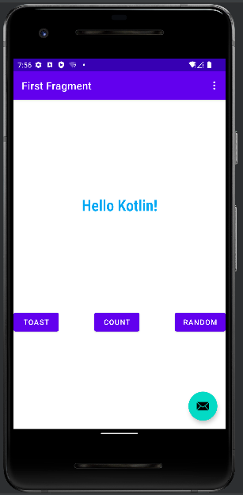

### 14、更新按钮和文本框的外观

①添加新的颜色资源

在values-》colors.xml定义了一些应用程序可以使用的颜色，添加新颜色screenBackground值为#2196F3，这是蓝色阴影颜色；添加新颜色buttonBackground值为#BBDEFB

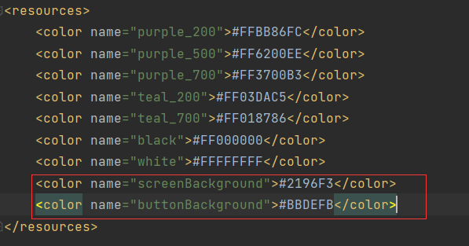

### 15、设置组件的外观

1、fragment_first.xml的属性面板中设置屏幕背景色为：

```xml
android:background="@color/screenBackground"
```

2、设置每个按钮的背景色为buttonBackground

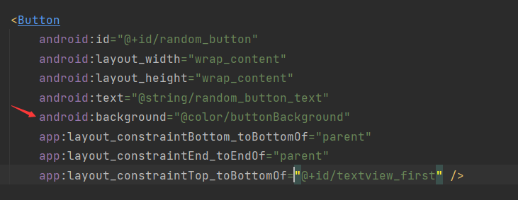

### 16、设置组件的位置

1、Toast与屏幕的左边距设置为24dp，Random与屏幕的右边距设置为24dp，使用属性面板的Constraint Widget完成设置。

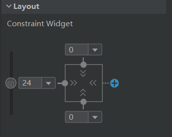


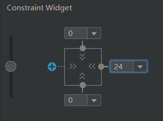

2、设置TextView的垂直偏移为0.3

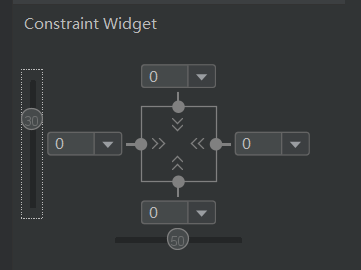

3、运行查看效果：

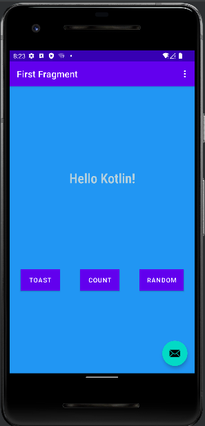

### 17、添加代码完成应用程序交互

设置代码自动补全：

在Andriod Studio中，依次点击File-》Projects Settings>Settings for New Projects…，查找Auto Import选项，在Java和Kotlin部分，勾选**Add Unambiguous Imports on the fly**。

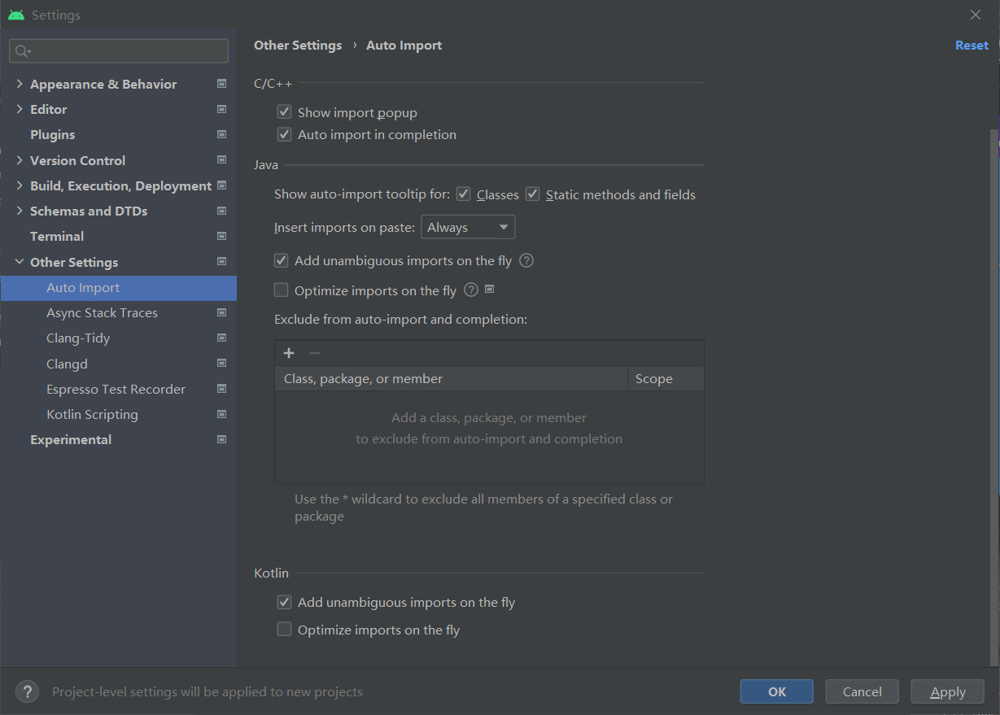


**TOAST按钮添加一个toast信息**

打开FirstFragment.kt文件，有三个方法：onCreateView，onViewCreated和onDestroyView，在onViewCreated方法中使用绑定机制设置按钮的响应事件（创建应用程序时自带的按钮）。接下来，为TOAST按钮添加事件，使用**findViewById()**查找按钮id，代码如下：

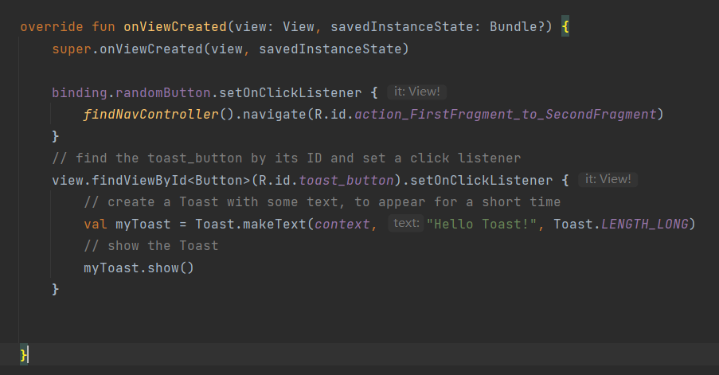

其中，使用了Lambda表达式的机制。

### 18、使Count按钮更新屏幕的数字

此步骤向Count按钮添加事件响应，更新Textview的文本显示。
在FirstFragment.kt文件，为count_buttion按钮添加事件：

```kotlin
view.findViewById<Button>(R.id.count_button).setOnClickListener {
    countMe(view)
}
```

countMe()为自定义方法，以View为参数，每次点击增加数字1，具体代码为：

```kotlin
private fun countMe(view: View) {
    // Get the text view
    val showCountTextView = view.findViewById<TextView>(R.id.textview_first)

    // Get the value of the text view.
    val countString = showCountTextView.text.toString()

    // Convert value to a number and increment it
    var count = countString.toInt()
    count++

    // Display the new value in the text view.
    showCountTextView.text = count.toString()
}
```

### ------------------------------------

### 19、完成第二界面的代码

此步骤将完成按照First Fragment显示数字作为上限，随机在Second Fragment上显示一个数字，即Random按钮的事件响应。

**向界面添加TextView显示随机数**

1. 打开fragment_second.xml的设计视图中，当前界面有两个组件，一个Button和一个TextView（textview_second）。
2. 去掉TextView和Button之间的约束
3. 拖动新的TextView至屏幕的中间位置，用来显示随机数
4. 设置新的TextView的id为**@+id/textview_random**
5. 设置新的TextView的左右约束至屏幕的左右侧，Top约束至textview_second的Bottom，Bottom约束至Button的Top
6. 设置TextView的字体颜色textColor属性为**@android:color/white**，**textSize**为**72sp**，**textStyle**为**bold**
7. 设置TextView的显示文字为“**R**”
8. 设置垂直偏移量**layout_constraintVertical_bias**为0.45

TextView最终代码：

```xml
<TextView
    android:id="@+id/textview_random"
    android:layout_width="wrap_content"
    android:layout_height="wrap_content"
    android:text="R"
    android:textColor="@android:color/white"
    android:textSize="72sp"
    android:textStyle="bold"
    app:layout_constraintBottom_toTopOf="@+id/button_second"
    app:layout_constraintEnd_toEndOf="parent"
    app:layout_constraintStart_toStartOf="parent"
    app:layout_constraintTop_toBottomOf="@+id/textview_second"
    app:layout_constraintVertical_bias="0.45"
    tools:ignore="UnknownId" />
```

### 20、更新显示界面文本的TextView(textview_second)

1. 在fragment_second.xml文件中，选择textview_second文本框，查看text属性

2. 更改该文本框id为textview_header

3. 设置layout_width为match_parent，layout_height为wrap_content。

4. 设置top，left和right的margin为24dp，左边距和右边距也就是start和end边距。

5. 若还存在与Button的约束，则删除。

6. 向colors.xml添加颜色colorPrimaryDark，并将TextView颜色设置为@color/colorPrimaryDark，字体大小为24sp。

   ```xml
   <color name="colorPrimaryDark">#3700B3</color>
   ```

7. strings.xml文件中，修改hello_second_fragment的值为"Here is a random number between 0 and %d."

8. 使用**Refactor>Rename**将hello_second_fragment 重构为random_heading

**因此，显示界面信息的Textview的代码为：**

```xml
<TextView
    android:id="@+id/textview_header"
    android:layout_width="0dp"
    android:layout_height="wrap_content"
    android:layout_marginStart="24dp"
    android:layout_marginLeft="24dp"
    android:layout_marginTop="24dp"
    android:layout_marginEnd="24dp"
    android:layout_marginRight="24dp"
    android:text="@string/random_heading"
    android:textColor="@color/colorPrimaryDark"
    android:textSize="24sp"
    app:layout_constraintEnd_toEndOf="parent"
    app:layout_constraintStart_toStartOf="parent"
    app:layout_constraintTop_toTopOf="parent" />
```

21、更改界面的背景色和按钮布局

1、向color.xmlcolors.xml文件添加第二个Fragment背景色的值，修改fragment_second.xml背景色的属性为`screenBackground2`

```xml
<color name="screenBackground2">#26C6DA</color>
```

```xml
android:background="@color/screenBackground2"
```

2、将按钮移动至界面的底部，完成所有布局之后，如下图所示：

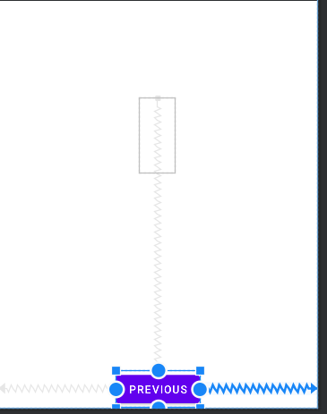

### 21、检查导航图

本项目选择Android的Basic Activity类型进行创建，默认情况下自带两个Fragments，并使用Android的导航机制Navigation。导航将使用按钮在两个Fragment之间进行跳转，就第一个Fragment修改后的Random按钮和第二个Fragment的Previous按钮。

打开nav_graph.xml文件（res>navigation>nav_graph.xml）：

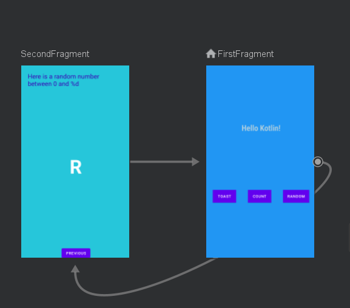

可任意拖动界面中元素，观察导航图变化。

### 22、启动SafeArgs

SafeArgs是一个gradle插件，它可以帮助我们在导航图中输入需要传递的数据信息，作用类似于Activity之间传递数据的Bundle。

1、首先打开**Gradle Scripts > build.gradle (Project: My First App)**

在Android Studio Bumblebee | 2021.1.1 Patch 3中，gradle的脚本发生巨大变化。在新版本中，Safeargs的依赖将这样添加：

Gradle的Project部分，在plugins节添加

**id 'androidx.navigation.safeargs.kotlin' version '2.5.0-alpha01' apply false**

module部分在plugins节添加

i**d 'androidx.navigation.safeargs'**

不同版本的Gradle在navigation插件版本不相同。


5、Android Studio开始同步依赖库

6、重新生成工程**Build > Make Project**

### 23、创建导航动作的参数

1、打开导航视图，点击**FirstFragmen**，查看其属性。

2、在**Actions**栏中可以看到导航至**SecondFragment**

3、同理，查看**SecondFragment**的属性栏

4、点击**Arguments** **"+"**符号

5、弹出的对话框中，添加参数**myArg**，类型为整型**Integer**

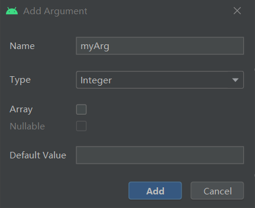

### 24、FirstFragment添加代码，向SecondFragment发数据

初始应用中，点击FirstFragment的Next/Random按钮将跳转到第二个页面，但没有传递数据。在本步骤中将获取当前TextView中显示的数字并传输至SecondFragment。

1、打开FirstFragment.kt源代码文件

2、找到onViewCreated()方法，该方法在onCreateView方法之后被调用，可以实现组件的初始化。找到Random按钮的响应代码，注释掉原先的事件处理代码

3、实例化TextView，获取TextView中文本并转换为整数值

```kotlin
val showCountTextView = view.findViewById<TextView>(R.id.textview_first)
val currentCount = showCountTextView.text.toString().toInt()
```

4、将`currentCount`作为参数传递给actionFirstFragmentToSecondFragment()

```kotlin
val action = FirstFragmentDirections.actionFirstFragmentToSecondFragment(currentCount)
```

5、添加导航事件代码

```kotlin
findNavController().navigate(action)
```

运行代码，点击FirstFragment的Count按钮，然后点击Random按钮，可以看到SecondFragment在头部的TextView已经显示正确的数字，但是屏幕中间还未出现随机数显示。

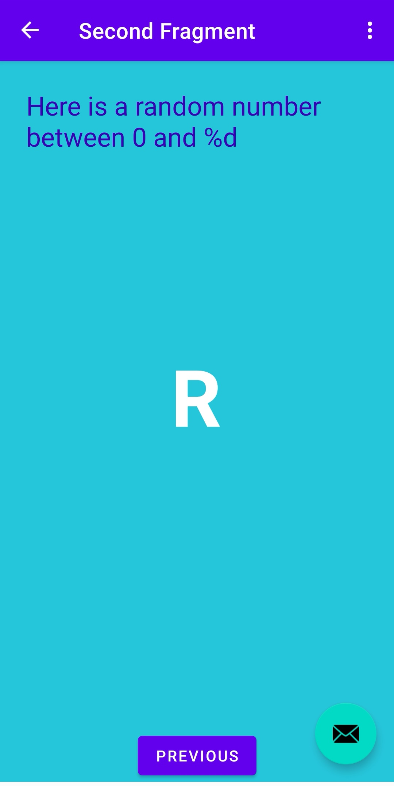

25、添加SecondFragement的代码

通过更新SecondFragment.kt的代码，接受传递过来的整型参数并进行处理。

1、导入navArgs包

```kotlin
import androidx.navigation.fragment.navArgs
```

2、`onViewCreated()`代码之前添加一行

```kotlin
val args: SecondFragmentArgs by navArgs()
```

3、`onViewCreated()`中获取传递过来的参数列表，提取count数值，并在textview_header中显示

```kotlin
val count = args.myArg
val countText = getString(R.string.random_heading, count)
view.findViewById<TextView>(R.id.textview_header).text = countText
```

4、根据count值生成随机数

```kotlin
val random = java.util.Random()
var randomNumber = 0
if (count > 0) {
    randomNumber = random.nextInt(count + 1)
}
```

5、textview_random中显示count值

```kotlin
view.findViewById<TextView>(R.id.textview_random).text = randomNumber.toString()
```

6、运行程序，查看效果：

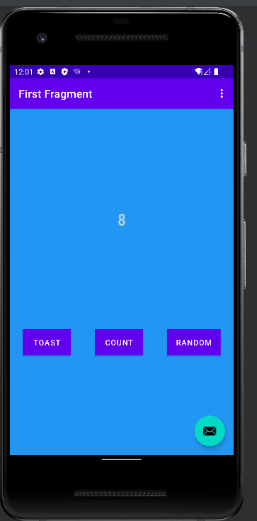

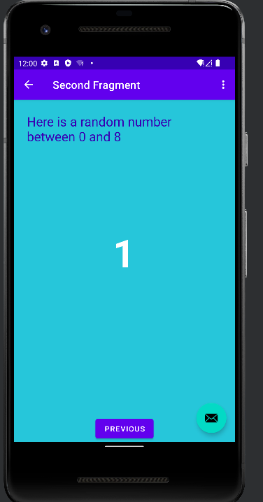

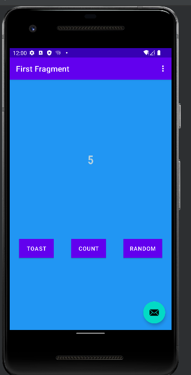

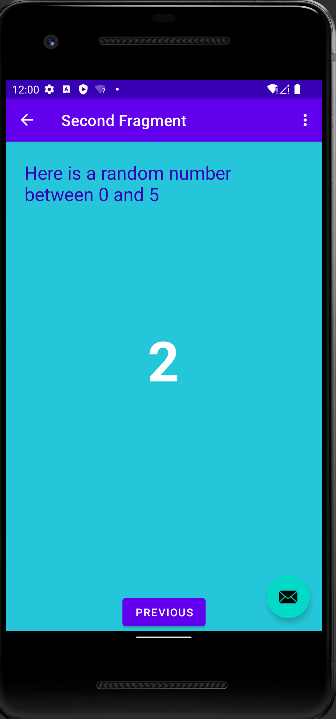
