## 实验三 基于TensorFlow Lite实现的Andriod花卉识别应用

### 准备工作

安装Andriod Studio 4.1以上版本

### 下载初始代码

首先创建一个工作目录，使用gitBash运行命令

```
git clone git@github.com:hoitab/TFLClassify.git
```

### 开始运行初始代码

1、打开Andriod Studio，打开下载完的项目

2、修改版本：

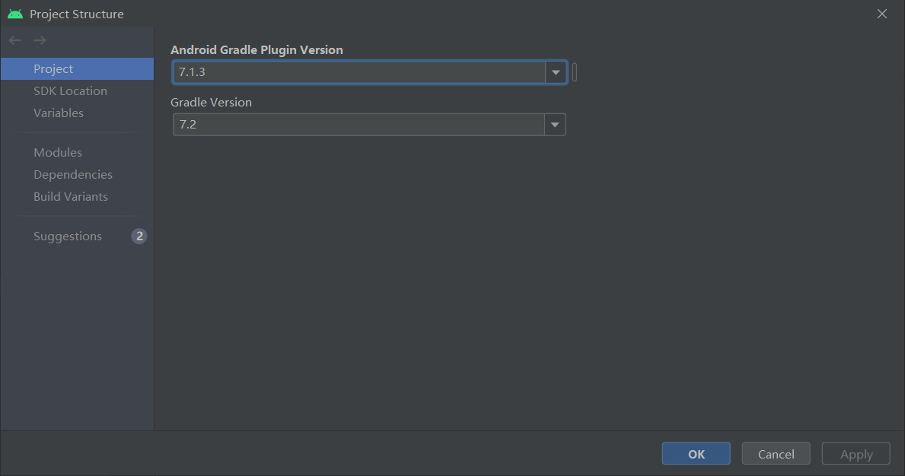

3、项目部署完毕后，可以看到项目的各个模块，module：finish、start，其中，finish模块是已经完成的项目，start则是本次实践的模块

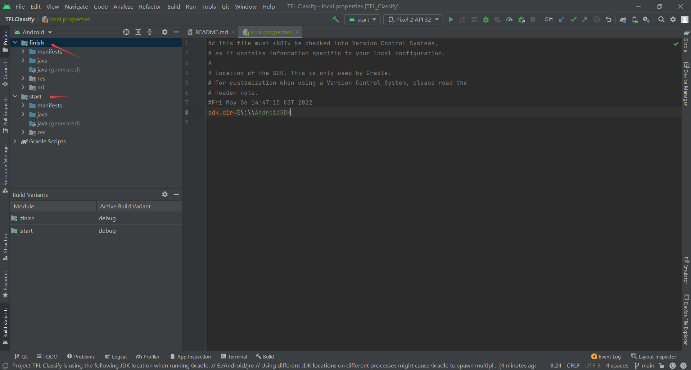

4、将手机通过USB接口连接到开发平台，并设置手机开发者选项允许调试。

5、选择真实物理机，运行start模块

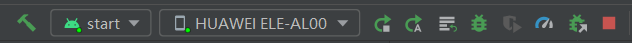

6、允许应用获取手机摄像头权限，得到以下的效果图，界面利用随机数表示虚拟的识别结果：

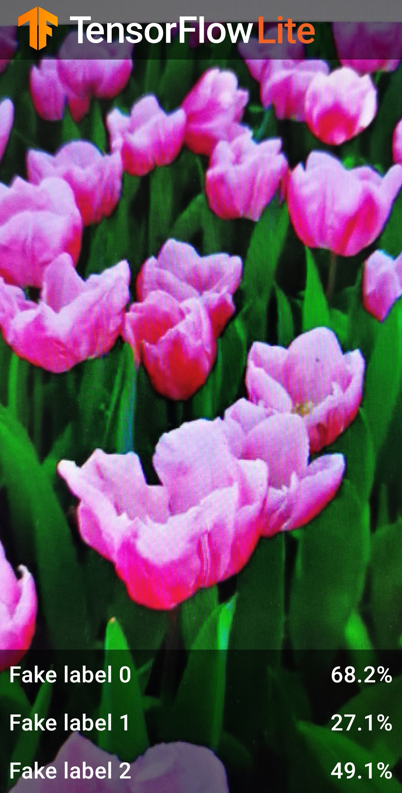

### 向应用中添加TensorFlow Lite

1、选择start模块

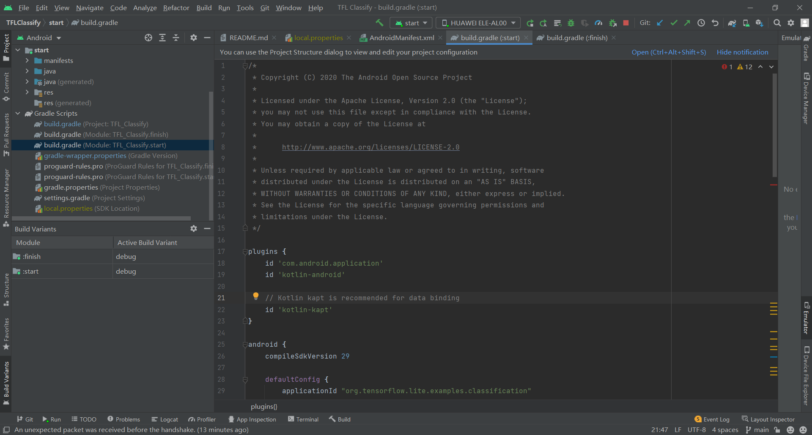

2、右键start模块，选择File,然后New->Other->TensorFlow Model

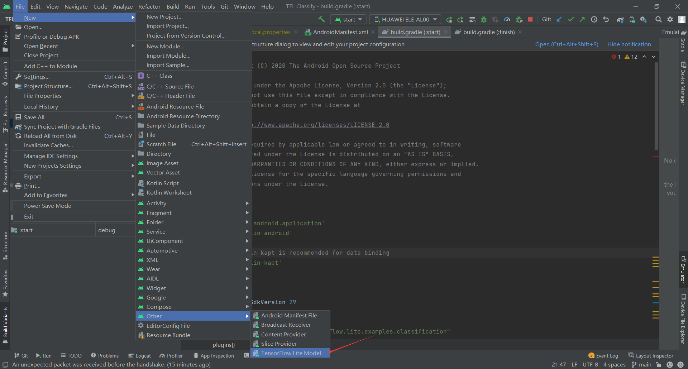

3、选择已经下载的自定义训练模型。选择finish模块中ml文件下的FlowModel.tflite

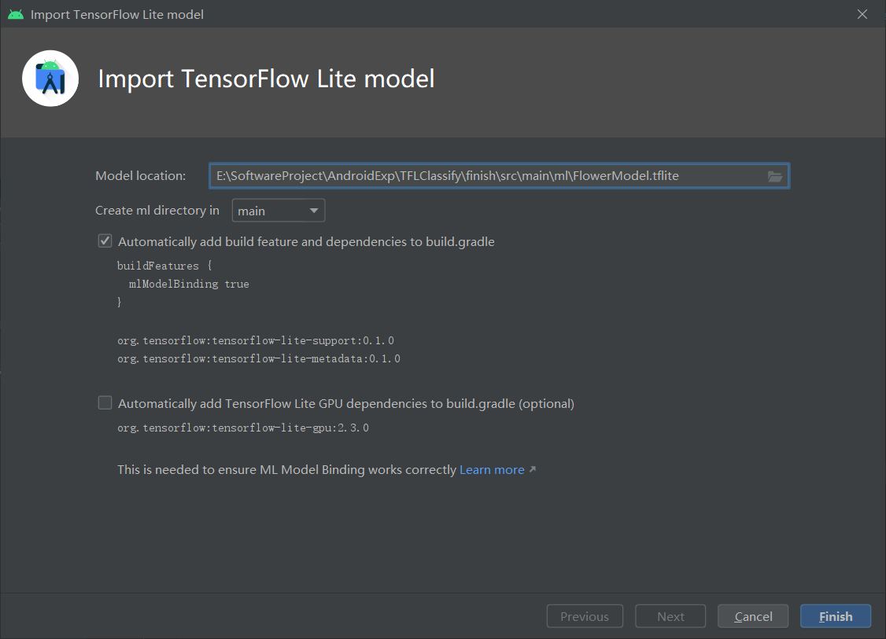

点击finish完成模型导入，系统将自动下载所需的依赖包并将依赖项添加至模块的build.gradle中。

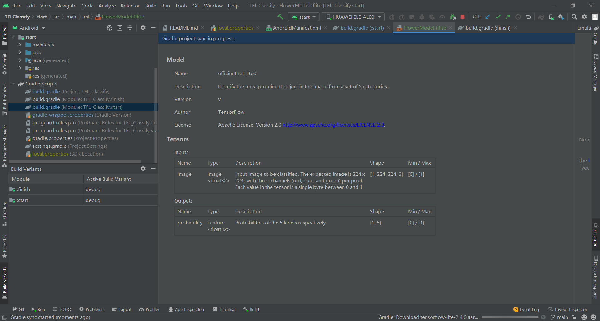

4、TensorFlow Lite模型被成功导入，生成了摘要信息

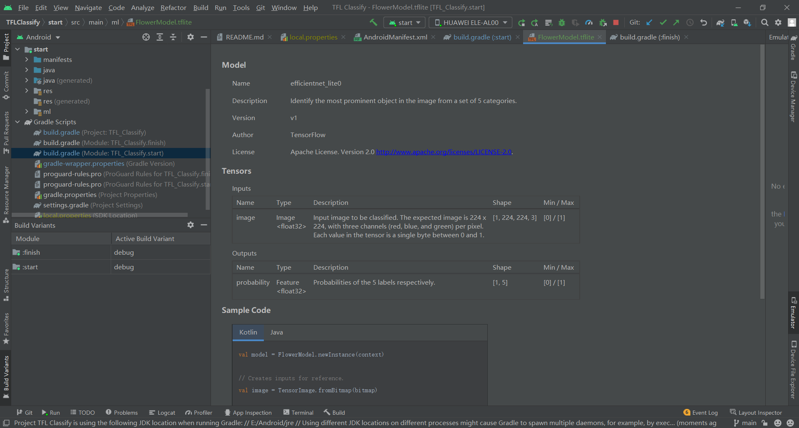

### 检查代码中TODO项

在本项目初始代码中包括了若干的TODO项，以导航项目中未完成之处，为了方便起见，首先查看TODO列表视图：View->Tool Windows->TODO

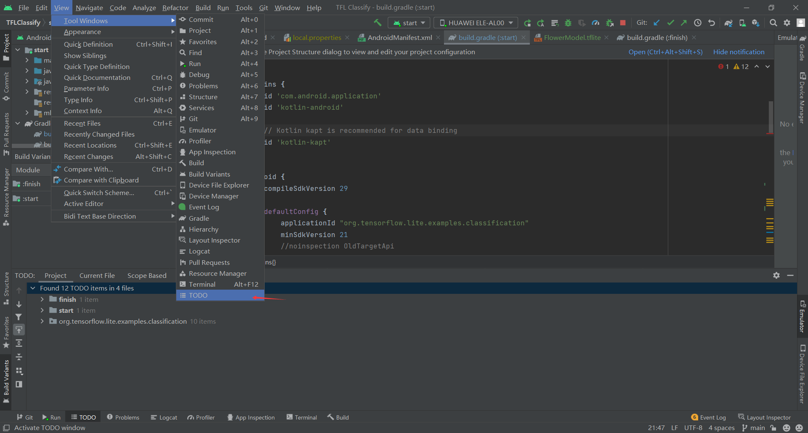

默认情况下列出了项目所有的TODO项，进一步按照模块分组（Group By）

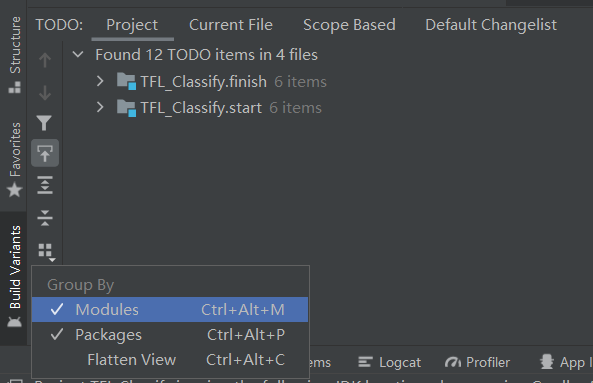

### 添加代码，重新运行APP

1、定位到‘start’模块MainActivity.kt文件的TODO 1,添加初始化训练模型的代码

```kotlin
private val flowerModel = FlowerModel.newInstance(ctx)
```

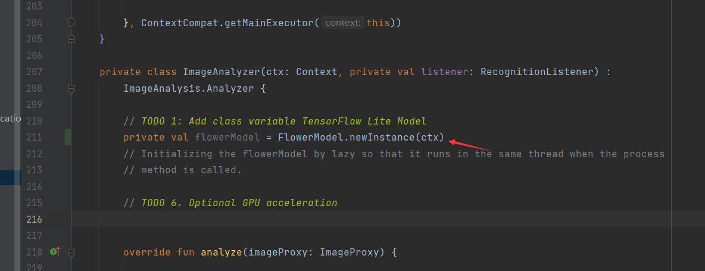

2、在CameraX的analyze方法内部，需要将摄像头的输入ImageProxy转化为Bitmap对象，并进一步转化为TensorImage对象：

```kotlin
val tfImage = TensorImage.fromBitmap(toBitmap(imageProxy))
```

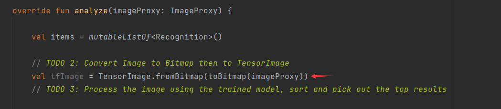

3、对图像进行处理并生成处理结果，操作如下：

①按照属性score对识别结果按照概率从高到低排序

②列出最高k种可能的结果，k的结果由常量MAX_RESULT_DISPLAY定义：

```kotlin
val outputs = flowerModel.process(tfImage)
    .probabilityAsCategoryList.apply {
        sortByDescending { it.score } // Sort with highest confidence first
    }.take(MAX_RESULT_DISPLAY) // take the top results
```

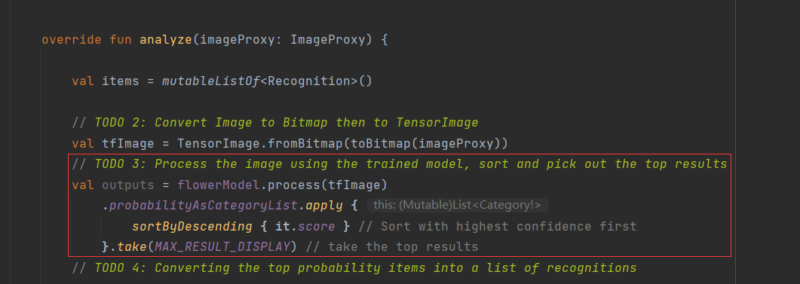

4、将识别的结果加入数据对象Recognition中，包含label和score两个元素。后续将用于RecyclerView的数据显示

```kotlin
for (output in outputs) {
    items.add(Recognition(output.label, output.score))
}
```

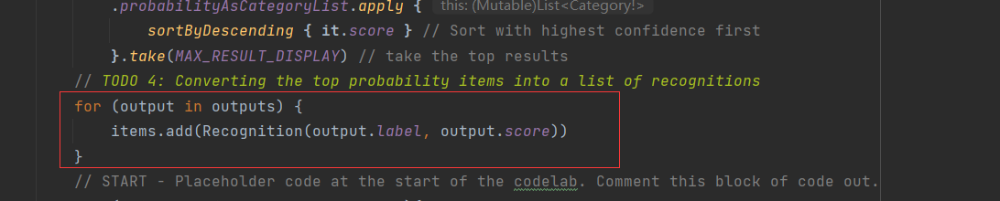

5、将原先用于虚拟显示识别结果的代码进行注释处理

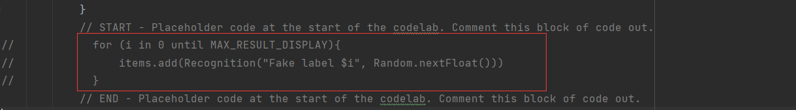

6、以物理设备重新运行start模块

7、最终运行效果如下：

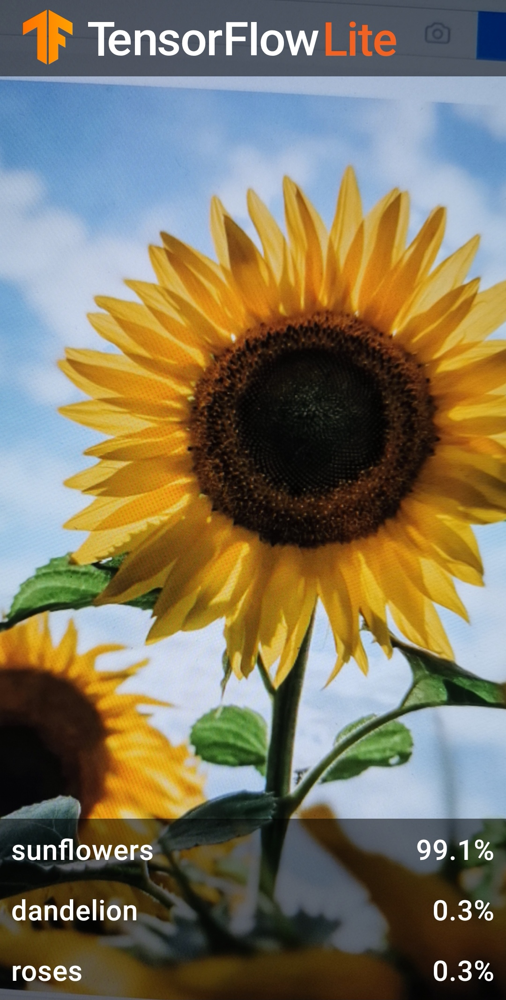