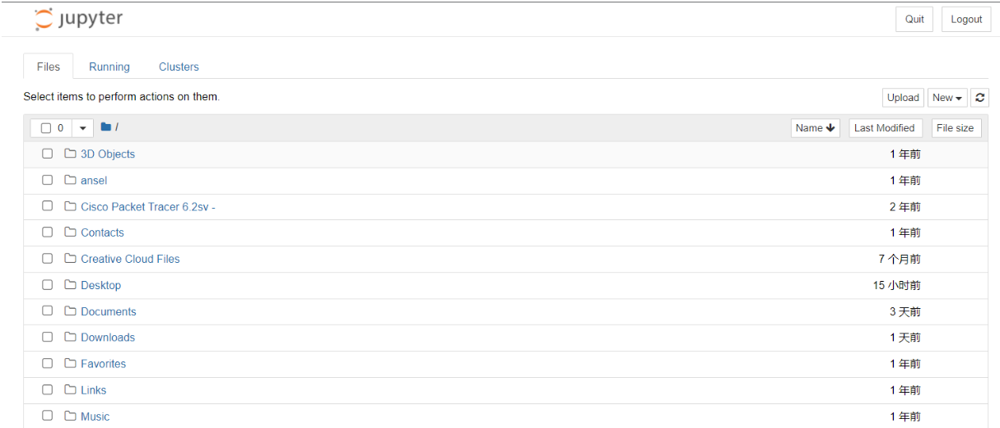
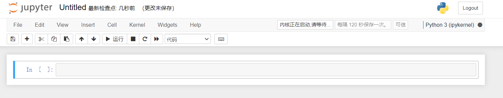
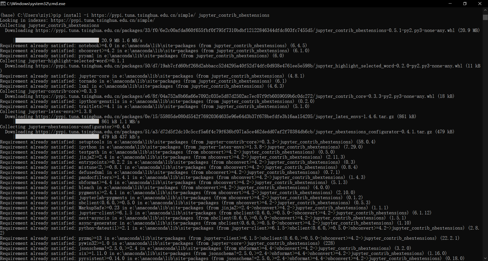
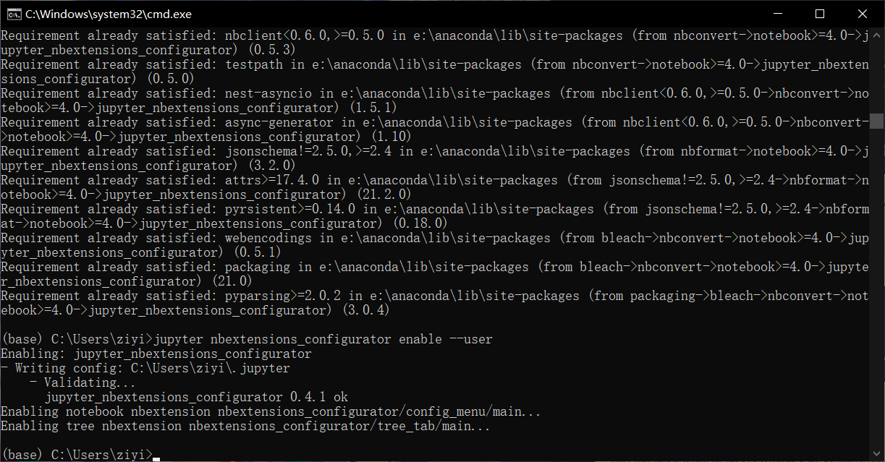
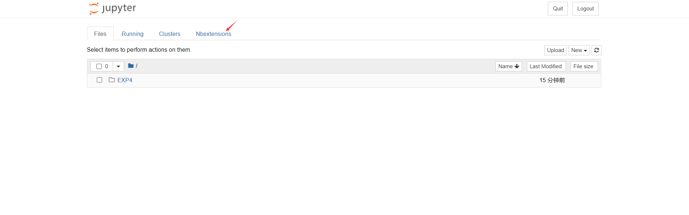
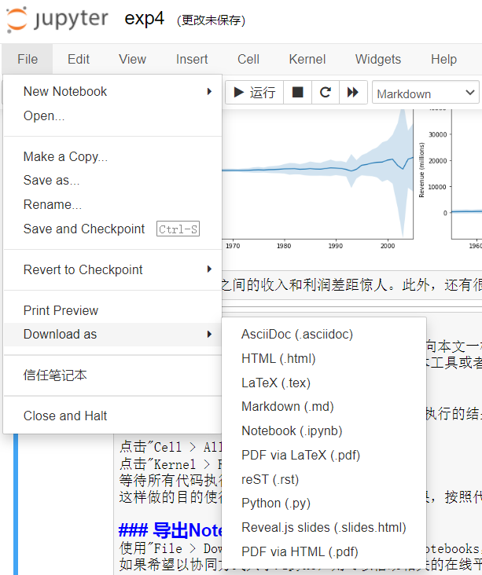

## 实验四 Notebook实践

### Jupyter Notebook简介
**Anaconda**是安装Jupyter Notebook的最佳方式。在安装完毕后，启动Anaconda
的Navigator,启动Notebook后，呈现如下界面：

观察页面，可以看到浏览器中显示类似http://localhost:8888/tree 的网址，表示本地运行着Notebook的服务器。

### 创建一个新的Notebook
新建一个Notebook Python 3 (ipykernel)，生成了一个Untitled.ipynb文件。.ipynb文件即所谓的一个Notebook，实际是基于JSON格式的文本文件，并且包含元数据(“Edit > Edit Notebook Metadata”)。新建的Notebook的界面大致如下：


这里，有两个关键元素即cell与kernal：

**·**cell: 文本或者代码执行单元，由kernel执行。
**·**kernel: 计算引擎，执行cell的文本或者代码，本文基于Python 3 ipykernel引擎。

### cell
主要包含两种类型的cell：

**·**代码cell：包含可被kernel执行的代码，执行之后在下方显示输出。
**·**Markdown cell：书写Markdown标记语言的cell。


现在输入一行代码，查看执行效果：


```python
print("Hello world")
```

    Hello world
    

代码执行之后，cell左侧的标签从In[1] 变成了 In [1]。In代表输入，[]中的数字代表kernel执行的顺序，而**In[ * ]**则表示代码cell正在执行代码。


```python
import time
time.sleep(3)
```

### cell模式
有两种模式，编辑模式（edit mode）和命名模式（command mode）

编辑模式：enter健切换，绿色轮廓
命令模式：esc健切换，蓝色轮廓

### 快捷键
使用Ctrl + Shift + P命令可以查看所有Notebook支持的命令。

在命名模式下，一些快捷键将十分有帮助

上下键头可以上下cell移动
A 或者 B在上方或者下方插入一个cell

M 将转换活动cell为Markdown cell

Y 将设置活动cell为代码 cell

D+D（两次）删除cell

Z 撤销删除

H 打开所有快捷键的说明

在编辑模式，Ctrl + Shift + -将以光标处作为分割点，将cell一分为二。


### 安装Jupyter Notebook拓展工具
Jupter Notebook的拓展工具(extensions)可以提供丰富的附加功能，例如代码补全、内容目录、变量检查等。本节演示如何安装扩展工具和启用代码补全功能。
首先在Anaconda Navigator中启动命令行终端：

在弹出的终端中，依次输入以下命令，等待命令执行完成：

pip install -i https://pypi.tuna.tsinghua.edu.cn/simple/ jupyter_contrib_nbextensions

jupyter contrib nbextension install --user

pip install -i https://pypi.tuna.tsinghua.edu.cn/simple/ jupyter_nbextensions_configurator

jupyter nbextensions_configurator enable --user


完成之后，重新打开Jupyter Notebook启动页面，可以看到：

点击Nbextensions标签，勾选Hinterland：


### Kernel
每个notebook都基于一个内核运行，当执行cell代码时，代码将在内核当中运行，运行的结果会显示在页面上。Kernel中运行的状态在整个文档中是延续的，可以跨越所有的cell。这意思着在一个Notebook某个cell定义的函数或者变量等，在其他cell也可以使用。例如：


```python
import numpy as np
def square(x):
    return x * x
```

执行上述代码cell之后，后续cell可以使用np和square


```python
x=np.random.randint(1,10)
y=square(x)
print('%d squared is %d' %(x,y))
```

    8 squared is 64
    

注意：Restart Kernal将清空保存在内存中的变量。同时，在浏览器中关闭一个正在运行的notebook页面，并未真正关闭终止Kernel的运行，其还是后台执行。要真正关闭，可选择File > Close and Halt，或者Kernel > Shutdown

## 简单的Python程序的例子-

### 1、定义selection_sort桉树执行选择排序功能


```python
def selection_sort(array):
    for i in range(len(array)-1):
        min_index = i
        for j in range(i+1, len(array)):
            if array[j] < array[min_index]:
                min_index = j
        if min_index != i:
            array[i], array[min_index] = array[min_index], array[i]
    return array
 

```

    [1, 2, 3, 4, 5]
    

### 2、定义test函数进行测试，执行数据输入，并调用selection_sort函数进行排序，最后输出结果。


```python
def test():
    list=[5,1,4,2,3];
    a=selection_sort(list);
    print(a)

test()

```

    [1, 2, 3, 4, 5]
    

## 数据分析

### 下载数据保存到EXCEL中


## 设置
导入相关工具库


```python
%matplotlib inline
import pandas as pd
import matplotlib.pyplot as plt
import seaborn as sns
```

pandas用于数据处理，matplotlib用于绘图，seaborn使绘图更美观。第一行不是python命令，而被称为line magic。%表示作用与一行，%%表示作用于全文。此处%matplotlib inline 表示使用matlib画图，并将图片输出。
之后，加载数据集。


```python
df = pd.read_csv('fortune500.csv')
```

### 检查数据集
上述代码执行生成的df对象，是pandas常用的数据结构，称为DataFrame，可以理解为数据表。


```python
df.head()
```


<div>
<style scoped>
    .dataframe tbody tr th:only-of-type {
        vertical-align: middle;
    }

    .dataframe tbody tr th {
        vertical-align: top;
    }

    .dataframe thead th {
        text-align: right;
    }
</style>
<table border="1" class="dataframe">
  <thead>
    <tr style="text-align: right;">
      <th></th>
      <th>Year</th>
      <th>Rank</th>
      <th>Company</th>
      <th>Revenue (in millions)</th>
      <th>Profit (in millions)</th>
    </tr>
  </thead>
  <tbody>
    <tr>
      <th>0</th>
      <td>1955</td>
      <td>1</td>
      <td>General Motors</td>
      <td>9823.5</td>
      <td>806</td>
    </tr>
    <tr>
      <th>1</th>
      <td>1955</td>
      <td>2</td>
      <td>Exxon Mobil</td>
      <td>5661.4</td>
      <td>584.8</td>
    </tr>
    <tr>
      <th>2</th>
      <td>1955</td>
      <td>3</td>
      <td>U.S. Steel</td>
      <td>3250.4</td>
      <td>195.4</td>
    </tr>
    <tr>
      <th>3</th>
      <td>1955</td>
      <td>4</td>
      <td>General Electric</td>
      <td>2959.1</td>
      <td>212.6</td>
    </tr>
    <tr>
      <th>4</th>
      <td>1955</td>
      <td>5</td>
      <td>Esmark</td>
      <td>2510.8</td>
      <td>19.1</td>
    </tr>
  </tbody>
</table>
</div>


```python
df.tail()
```


<div>
<style scoped>
    .dataframe tbody tr th:only-of-type {
        vertical-align: middle;
    }

    .dataframe tbody tr th {
        vertical-align: top;
    }

    .dataframe thead th {
        text-align: right;
    }
</style>
<table border="1" class="dataframe">
  <thead>
    <tr style="text-align: right;">
      <th></th>
      <th>Year</th>
      <th>Rank</th>
      <th>Company</th>
      <th>Revenue (in millions)</th>
      <th>Profit (in millions)</th>
    </tr>
  </thead>
  <tbody>
    <tr>
      <th>25495</th>
      <td>2005</td>
      <td>496</td>
      <td>Wm. Wrigley Jr.</td>
      <td>3648.6</td>
      <td>493</td>
    </tr>
    <tr>
      <th>25496</th>
      <td>2005</td>
      <td>497</td>
      <td>Peabody Energy</td>
      <td>3631.6</td>
      <td>175.4</td>
    </tr>
    <tr>
      <th>25497</th>
      <td>2005</td>
      <td>498</td>
      <td>Wendy's International</td>
      <td>3630.4</td>
      <td>57.8</td>
    </tr>
    <tr>
      <th>25498</th>
      <td>2005</td>
      <td>499</td>
      <td>Kindred Healthcare</td>
      <td>3616.6</td>
      <td>70.6</td>
    </tr>
    <tr>
      <th>25499</th>
      <td>2005</td>
      <td>500</td>
      <td>Cincinnati Financial</td>
      <td>3614.0</td>
      <td>584</td>
    </tr>
  </tbody>
</table>
</div>


对数据属性列进行重命名，以便在后续访问


```python
df.columns = ['year', 'rank', 'company', 'revenue', 'profit']
```

之后，检查数据条目是否加载完整。


```python
len(df)
```


    25500


从1955至2055年总共有25500条目录。然后，检查属性列的类型。


```python
df.dtypes
```


    year         int64
    rank         int64
    company     object
    revenue    float64
    profit      object
    dtype: object


其他属性列都正常，但是对于profit属性，期望的结果是float类型，因此其可能包含非数字的值，利用正则表达式进行检查。


```python
non_numberic_profits = df.profit.str.contains('[^0-9.-]')
df.loc[non_numberic_profits].head()
```


<div>
<style scoped>
    .dataframe tbody tr th:only-of-type {
        vertical-align: middle;
    }

    .dataframe tbody tr th {
        vertical-align: top;
    }

    .dataframe thead th {
        text-align: right;
    }
</style>
<table border="1" class="dataframe">
  <thead>
    <tr style="text-align: right;">
      <th></th>
      <th>year</th>
      <th>rank</th>
      <th>company</th>
      <th>revenue</th>
      <th>profit</th>
    </tr>
  </thead>
  <tbody>
    <tr>
      <th>228</th>
      <td>1955</td>
      <td>229</td>
      <td>Norton</td>
      <td>135.0</td>
      <td>N.A.</td>
    </tr>
    <tr>
      <th>290</th>
      <td>1955</td>
      <td>291</td>
      <td>Schlitz Brewing</td>
      <td>100.0</td>
      <td>N.A.</td>
    </tr>
    <tr>
      <th>294</th>
      <td>1955</td>
      <td>295</td>
      <td>Pacific Vegetable Oil</td>
      <td>97.9</td>
      <td>N.A.</td>
    </tr>
    <tr>
      <th>296</th>
      <td>1955</td>
      <td>297</td>
      <td>Liebmann Breweries</td>
      <td>96.0</td>
      <td>N.A.</td>
    </tr>
    <tr>
      <th>352</th>
      <td>1955</td>
      <td>353</td>
      <td>Minneapolis-Moline</td>
      <td>77.4</td>
      <td>N.A.</td>
    </tr>
  </tbody>
</table>
</div>


精经过检查确实存在这样的记录，profit这一列为字符串，统计一下到底存在多少条这样的记录。


```python
len(df.profit[non_numberic_profits])
```


    369


总体来说，利润（profit）列包含非数字的记录相对来说较少。更进一步，使用直方图显示一下按照年份的分布情况。


```python
bin_sizes, _, _ = plt.hist(df.year[non_numberic_profits], bins=range(1955, 2006))
```


    

    


可见，单独年份这样的记录数都少于25条，即少于4%的比例。这在可以接受的范围内，因此删除这些记录。


```python
df = df.loc[~non_numberic_profits]
df.profit = df.profit.apply(pd.to_numeric)
```

再次检查数据记录的条目数。


```python
len(df)
```


    25131


```python
df.dtypes
```


    year         int64
    rank         int64
    company     object
    revenue    float64
    profit     float64
    dtype: object


可见，经过上述操作已经达到清洗无效数据记录的效果。

## 使用matplotlib进行绘图
以年分组绘制平均利润和收入。首先定义变量和方法。


```python
group_by_year = df.loc[:, ['year', 'revenue', 'profit']].groupby('year')
avgs = group_by_year.mean()
x = avgs.index
y1 = avgs.profit
def plot(x, y, ax, title, y_label):
    ax.set_title(title)
    ax.set_ylabel(y_label)
    ax.plot(x, y)
    ax.margins(x=0, y=0)

```

开始绘图


```python
fig, ax = plt.subplots()
plot(x, y1, ax, 'Increase in mean Fortune 500 company profits from 1955 to 2005', 'Profit (millions)')

```


    

    


绘制收入曲线：


```python
y2 = avgs.revenue
fig, ax = plt.subplots()
plot(x, y2, ax, 'Increase in mean Fortune 500 company revenues from 1955 to 2005', 'Revenue (millions)')
```


    

    


对数据结果进行标准差处理：


```python
def plot_with_std(x, y, stds, ax, title, y_label):
    ax.fill_between(x, y - stds, y + stds, alpha=0.2)
    plot(x, y, ax, title, y_label)
fig, (ax1, ax2) = plt.subplots(ncols=2)
title = 'Increase in mean and std Fortune 500 company %s from 1955 to 2005'
stds1 = group_by_year.std().profit.values
stds2 = group_by_year.std().revenue.values
plot_with_std(x, y1.values, stds1, ax1, title % 'profits', 'Profit (millions)')
plot_with_std(x, y2.values, stds2, ax2, title % 'revenues', 'Revenue (millions)')
fig.set_size_inches(14, 4)
fig.tight_layout()
```


    

    


可见，不同公司之间的收入和利润差距惊人。此外，还有很多有价值的信息值得进一步挖掘。

## 分享Notebooks
分享Notebooks通常来说一般存在两种形式：一种向本文一样以静态非交互式分享（html,markdown,pdf等）；另外一种通过Git版本工具或者Google Colab进行协同开发

### 分享之前的工作
分享的Notebooks应包括代码执行的输出，要保证执行的结果符合预期，需完成以下几件事：

点击"Cell > All Output > Clear"
点击"Kernel > Restart & Run All"
等待所有代码执行完毕
这样做的目的使得Notebook不含有中间的执行结果，按照代码执行的顺序，产生稳定的结果。

### 导出Notebooks
使用"File > Download as"可以以多种格式导出Notebooks，例如：html, pdf, markdown文档等。如果希望以协同方式共享.ipynb，则可以借助相关的在线平台，如Github或者Google Colab。


