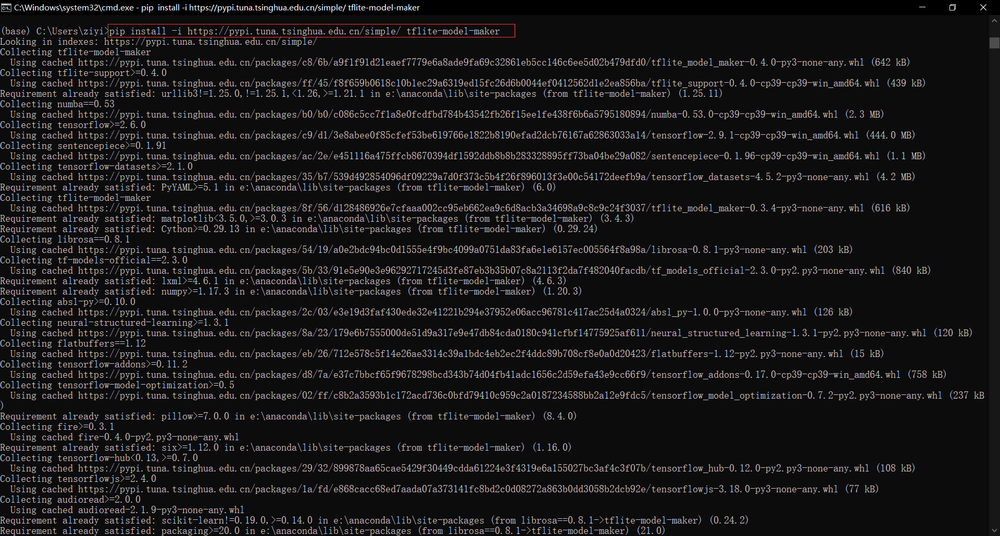
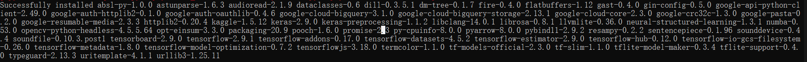
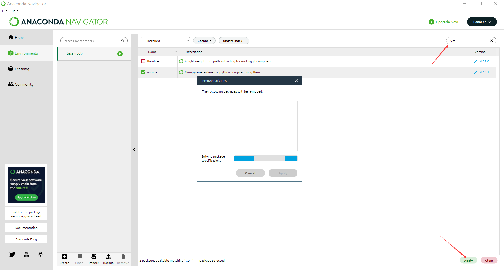
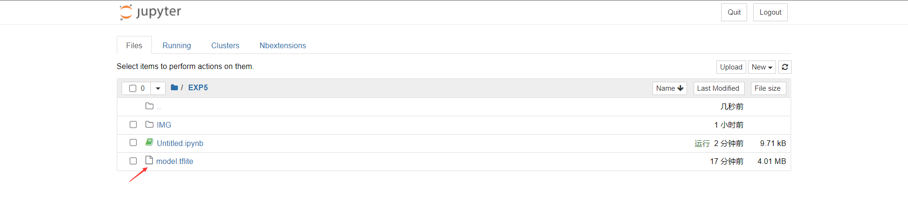

# 实验五 使用TensorFlow Lite Model Maker生成图像分类器模型

本次实验，使用TensorFlow Lite Model Maker library来生成图像分类器模型。TensorFlow Lite Model Maker可以简化使用自定义数据集训练 TensorFlow Lite模型的过程。该库使用了迁移学习来减少所需的训练数据量并缩短了训练时间。

# 准备工作

首先安装运行必备库：

!pip install -i https://pypi.tuna.tsinghua.edu.cn/simple/ tflite-model-maker




卸载llvmlite


然后，导入相关的库


```python
import os

import numpy as np

import tensorflow as tf
assert tf.__version__.startswith('2')

from tflite_model_maker import model_spec
from tflite_model_maker import image_classifier
from tflite_model_maker.config import ExportFormat
from tflite_model_maker.config import QuantizationConfig
from tflite_model_maker.image_classifier import DataLoader

import matplotlib.pyplot as plt

```

# 进行模型训练

## 获取数据
首先从较小的数据集开始进行训练，如果数据越多，模型的精度则越高。


```python
image_path = tf.keras.utils.get_file(
      'flower_photos.tgz',
      'https://storage.googleapis.com/download.tensorflow.org/example_images/flower_photos.tgz',
      extract=True)
image_path = os.path.join(os.path.dirname(image_path), 'flower_photos')

```

此处从storage.googleapis.com中下载了本实验所需要的数据集。image_path可以定制，默认在用户目录的.keras\datasets中。

## 运行

### 第一步 加载数据集，并将数据集分为训练数据与测试数据


```python
data = DataLoader.from_folder(image_path)
train_data, test_data = data.split(0.9)
```

    INFO:tensorflow:Load image with size: 3670, num_label: 5, labels: daisy, dandelion, roses, sunflowers, tulips.


### 第二步 训练Tensorflow模型


```python
# 使用默认模型，不推荐，出现网络问题
# model = image_classifier.create(train_data)

# 模型下载到本地，推荐
#inception_v3_spec = image_classifier.ModelSpec(uri='D:\Workspace\JupyterNotebookFiles\E5\efficientnet_lite0_feature-vector_2')

# 使用在线模型，推荐
inception_v3_spec = image_classifier.ModelSpec(uri='https://storage.googleapis.com/tfhub-modules/tensorflow/efficientnet/lite0/feature-vector/2.tar.gz')

inception_v3_spec.input_image_shape = [240, 240]
model = image_classifier.create(train_data, model_spec=inception_v3_spec)

```

    INFO:tensorflow:Retraining the models...
    Model: "sequential"
    _________________________________________________________________
     Layer (type)                Output Shape              Param #   
    =================================================================
     hub_keras_layer_v1v2 (HubKe  (None, 1280)             3413024   
     rasLayerV1V2)                                                   
                                                                     
     dropout (Dropout)           (None, 1280)              0         
                                                                     
     dense (Dense)               (None, 5)                 6405      
                                                                     
    =================================================================
    Total params: 3,419,429
    Trainable params: 6,405
    Non-trainable params: 3,413,024
    _________________________________________________________________
    None
    Epoch 1/5


    E:\Anaconda\lib\site-packages\keras\optimizers\optimizer_v2\gradient_descent.py:108: UserWarning: The `lr` argument is deprecated, use `learning_rate` instead.
      super(SGD, self).__init__(name, **kwargs)


    103/103 [==============================] - 42s 396ms/step - loss: 0.8708 - accuracy: 0.7758
    Epoch 2/5
    103/103 [==============================] - 44s 423ms/step - loss: 0.6565 - accuracy: 0.8962
    Epoch 3/5
    103/103 [==============================] - 40s 391ms/step - loss: 0.6240 - accuracy: 0.9135
    Epoch 4/5
    103/103 [==============================] - 41s 395ms/step - loss: 0.6065 - accuracy: 0.9257
    Epoch 5/5
    103/103 [==============================] - 43s 422ms/step - loss: 0.5946 - accuracy: 0.9308


### 第三步 评估模型


```python
loss, accuracy = model.evaluate(test_data)
```

    12/12 [==============================] - 6s 374ms/step - loss: 0.5878 - accuracy: 0.9346


### 第四步 导出Tensorflow Lite模型


```python
model.export(export_dir='.')
```

    INFO:tensorflow:Assets written to: C:\Users\ziyi\AppData\Local\Temp\tmps8c_q6mw\assets


    INFO:tensorflow:Assets written to: C:\Users\ziyi\AppData\Local\Temp\tmps8c_q6mw\assets
    E:\Anaconda\lib\site-packages\tensorflow\lite\python\convert.py:766: UserWarning: Statistics for quantized inputs were expected, but not specified; continuing anyway.
      warnings.warn("Statistics for quantized inputs were expected, but not "


    INFO:tensorflow:Label file is inside the TFLite model with metadata.


    INFO:tensorflow:Label file is inside the TFLite model with metadata.


    INFO:tensorflow:Saving labels in C:\Users\ziyi\AppData\Local\Temp\tmph48jvenm\labels.txt


    INFO:tensorflow:Saving labels in C:\Users\ziyi\AppData\Local\Temp\tmph48jvenm\labels.txt


    INFO:tensorflow:TensorFlow Lite model exported successfully: .\model.tflite


    INFO:tensorflow:TensorFlow Lite model exported successfully: .\model.tflite


这里导出的模型存放于Jupyter Notebook当前的工作目录中：

